**Docker**

**Docker  
**

Docker is a tool designed to make it easier to create, deploy, and run applications by using containers. A container is a standard unit of software, so the application runs quickly and reliably from one computing environment to another computing environment. Containers are advanced to virtual machines. To reduce the deployment time and down time we use containers.

Docker is used to run services and applications, an OS image (for example centOS) won’t run in docker, it exits out immediately. Unlike VM's, containers are not meant to host an OS, containers are meant to run a specific task or process such as to host an instance of a web server or application server or a database or simply to carry out some kind of computation or analysis. Once the task is complete the container exits the container only as long as the process inside it is alive. A library is a default repository which has the official images.

Docker has two editions the Community Edition and the enterprise edition, the community edition is the

set of free Docker products. The Enterprise Edition is certified and supported container platform that

comes with enterprise add-ons like the image management, image Security and universal control plan for

managing and orchestrating container run times.

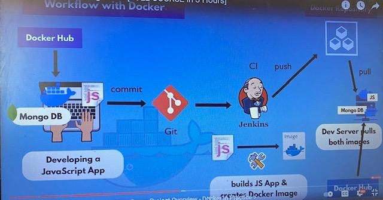

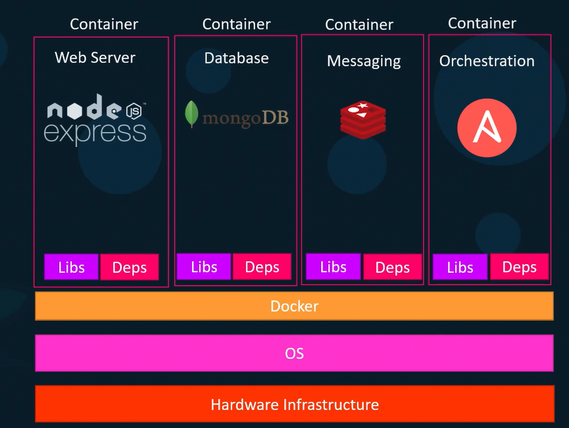

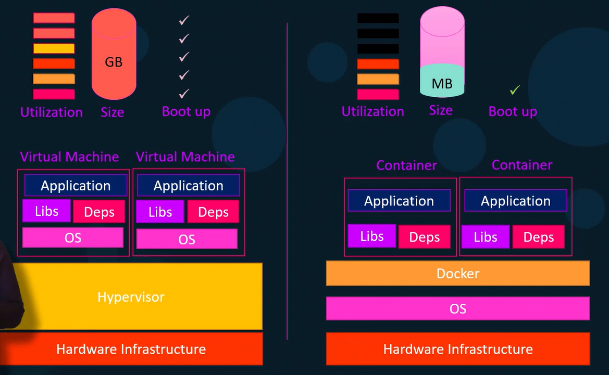

**Container**

Containers are completely isolated environments, as in they can have their own processes or services, their own network interfaces, their own mounts, just like virtual machines except they all share the same OS kernel. Some of the different types of containers are LXC, LXD, LXCFS etc. docker utilizes LXC containers. The main purpose of Docker is to package and containerize applications and to ship them and to run them anywhere any time as many times as you want.

**Virtual machine**

A computer system created using software on one physical computer in order to emulate the functionality of another separate physical computer.

**VMware**

Virtual machine software that allows multiple copies of the same operating system or several different operating systems to run in the same machine.

**Docker image**

An image is a combination of a file system and parameters. The **docker run** command is used to mention that we want to create an instance of an image, which is then called a container. Every docker image must be based off of another image, either an OS or another image that was created before based on an OS. All official releases of all operating systems can be found on **Docker hub**.

**The difference between docker image and container is**, an image is a package or a template just like a VM template, it is used to create one or more containers.

Containers are running instances of images that are isolated and have their own environments and set of processes.

Unlike virtual machines, Containers are not meant to host an operating system. Containers are meant to run a specific task or process such as to host an instance of a web server or application server or a database or simply to carry some kind of computation or analysis task. Once the task is complete the container exits. A container only lives as long as the process inside it is alive. If the web service inside the container is stopped or a crash then the container exits. This is why when you run a container from an Ubuntu image it stops immediately because Ubuntu is just an image of an operating system that is used as the base image for other applications. There is no process or application running in it by default.

When you run a container and it exits, the container actually lives on the disk drive.

**RUN-STDIN**

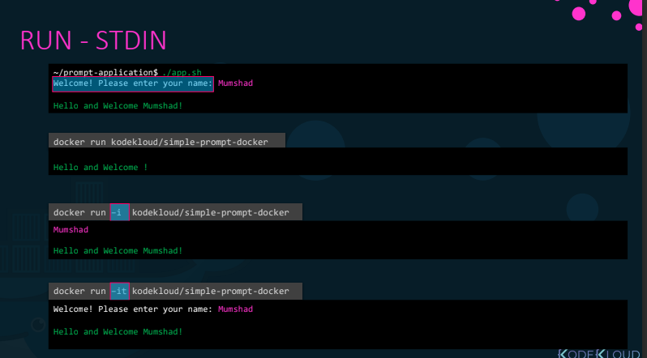

1.  > Run-STDIN

> Docker run –it applicationname (to run application on container in an interactive mode)

**Run-port mapping**

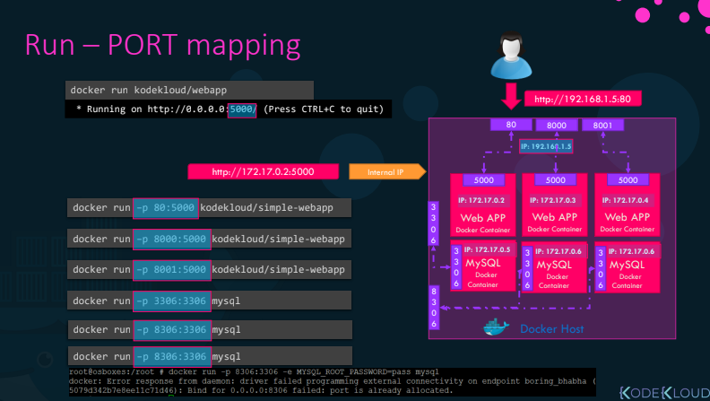

Let's go back to the example where we are on a simple web application in a Docker container on Docker host. Remember, **the underlying host where Docker is installed is called Docker host or Docker engine.** When we run a containerized web application, it runs and we are able to see that the server is running. But how does a user access the application? As you can see, the application is listening on Port 5000. so I could access the application by using Port 5000. But what IP do I use to access it from a web browser? There are two options available. One is to use the IP of the Docker container.

Every Docker container gets an IP assigned by default. In this case, it is 172.17.0.2. But remember that this is an internal IP and is only accessible within the Docker host. So if you open a browser from within the Docker host, you can go to [http://172.17.0.2:5000](http://172.17.0.2:5000) to access the IP address. But since this is an internal IP, users outside of the docker host cannot access it using this IP. For this, we could use the IP of the Docker host, which is 192.168.1.5.

But for that to work, you must have mapped the port inside the Docker container to a free port on the

Docker host, for example, for one of the users to access the application through Port 80 on the Docker

host. I could map Port 80 of the local host to Port 5000 on the Docker container using the **-p** parameter in the command like this(**docker run -p 80:5000 imagename**) And so the user can access my application by going to the URL, **http://192.168.1.5:80**. And all traffic on Port 80 on my docker host will get routed to port 5000 inside the Docker container. This way, you can run multiple instances of your application and map them to different ports on the docker host or run instances of different applications on different ports. For example, in this case, I'm running an instance of mysql that runs a database on my host and listens on the default mysql port, which happens to be 3306 or another instance of mysql on another port 8306. So you can run as many applications like this and map them to as many ports as you want. And of course, you cannot map to the same port on the dock or host more than once.

For that to work, you must have mapped the port inside the docker container to a free port on the docker host. For example, for one of the users to access the application through port 80 on the docker host, port 80 must be mapped off to a local host to port 5000 on the docker container using the –p parameter in the run command..

**Run – Volume mapping**

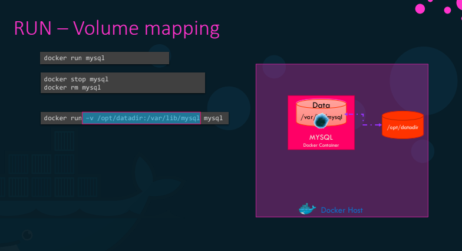

**Docker file**

Docker file is a text file written in a specific format, a docker can understand, it is an instruction and argument format.

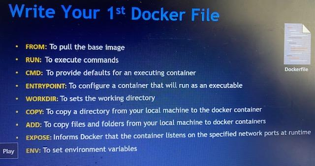

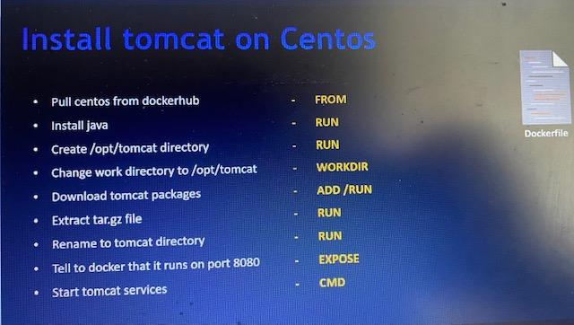

Docker file based on above

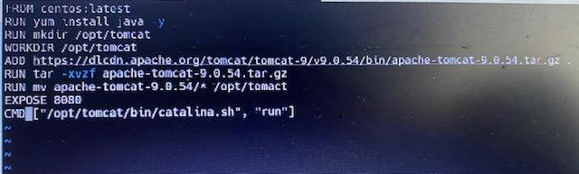

**Docker file**

Sudo Vi Dockerfile

FROM ubuntu:18.04

RUN apt-get install –y git

RUN apt-get install –y vim

Now we need to build the file or image,

Sudo docker build –t imagename:version locationofdockerfile.

. (dot- for present directory)

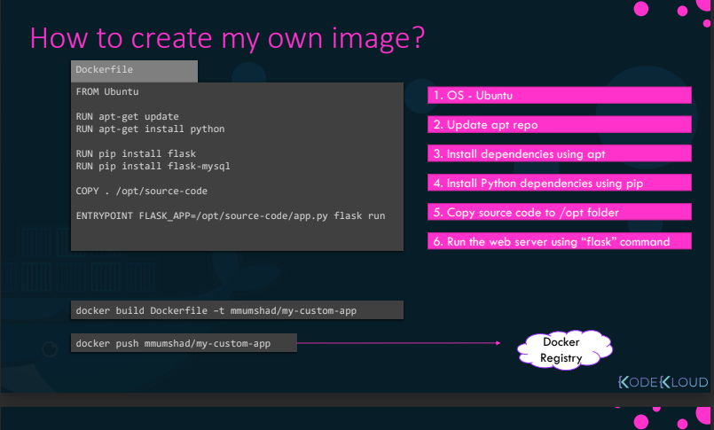

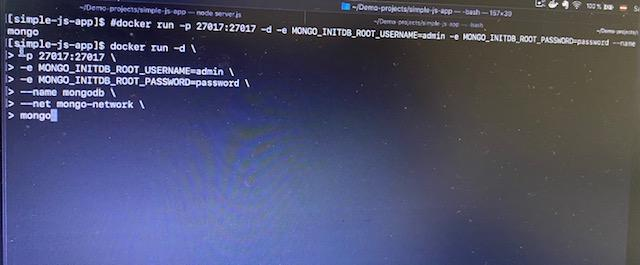

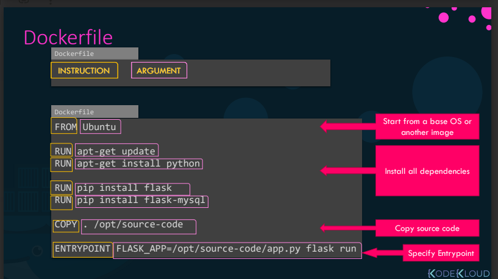

Every docker image must be based on another image, either an OS or another image that was created before based on an OS. Whenever a docker builds an image it builds and caches each layer (each step). So all the layers are cached and we don’t really have to even rebuild the image without any changes. It's just going to build real quick and it's not actually going to go through the whole build process. The entry point instruction is like the command instruction as in, you can specify the program that will be run when the container starts and whatever we specify on the command line, will get appended to the entry point.

In case of the CMD instruction the command line parameters passed will get replaced entirely whereas in case of entry point the command line parameters will get appended.

**Environment Variables**

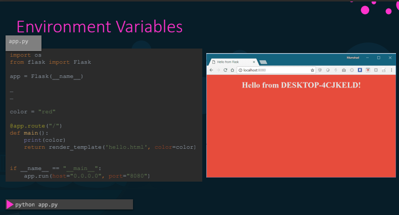

Let us take a simple web application written in Python. This piece of code is used to create a web application that displays a web page with a background color. If you look closely into the application code you will see a line that sets the background color to red. Now that works just fine. However if you decide to change the color in the future you will have to change the application code. It is a best practice to move such information out of the application code and into say an environment variable called APP\_COLOR.

**Command VS Entrypoint**

CMD in docker file, which stands for command, that defines the program that will be run within the container it starts.

docker run \<image-name\> \<command\> → example - docker run ubuntu sleep 5

To make it permanent create a dockerfile using ubuntu image, and put CMD sleep 5 as shown in the below image

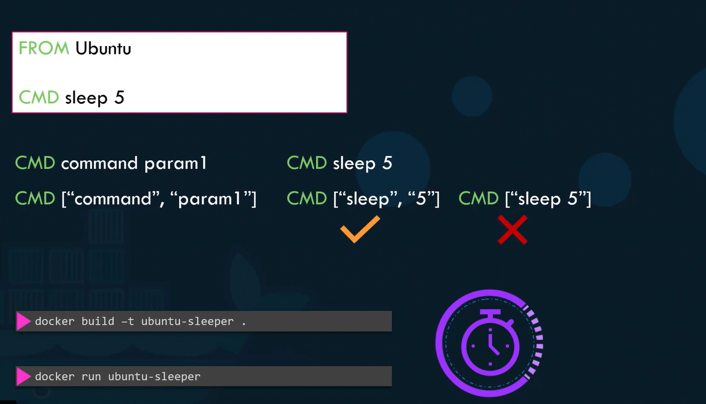

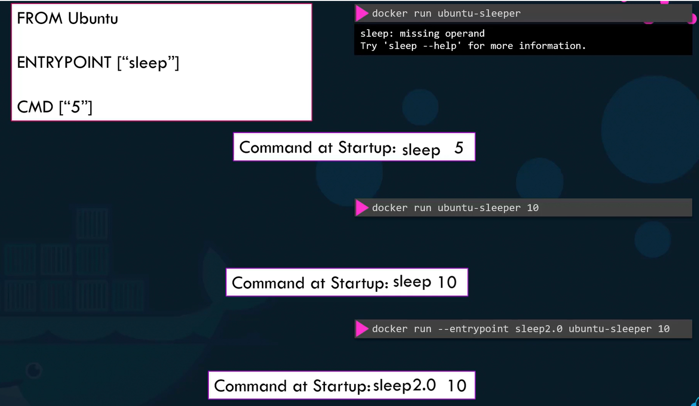

The Entry point allows to specify a command that will be run when the image is run as a container.

The difference between the two is, in case of CMD instruction, the command line parameters passed will get replaced entirely, whereas in case of entry point, the command line parameters will get appended. In simpler terms, **CMD sets default commands that can be overridden, while ENTRYPOINT defines the main command that always runs when the container starts.**

**Docker compose**

Docker compose is a tool used to define and run multiple Docker containers together as one application.

If we needed to set up a complex application running multiple services, a better way to do it is to use docker compose. With docker compose, we could create a configuration file in YAML format called docker-compose.yml, and put together the different services and the options specific to running them in this file. This is all applicable to running containers on a single host.

This docker compose file would be used on the server to deploy all the applications/services.

> 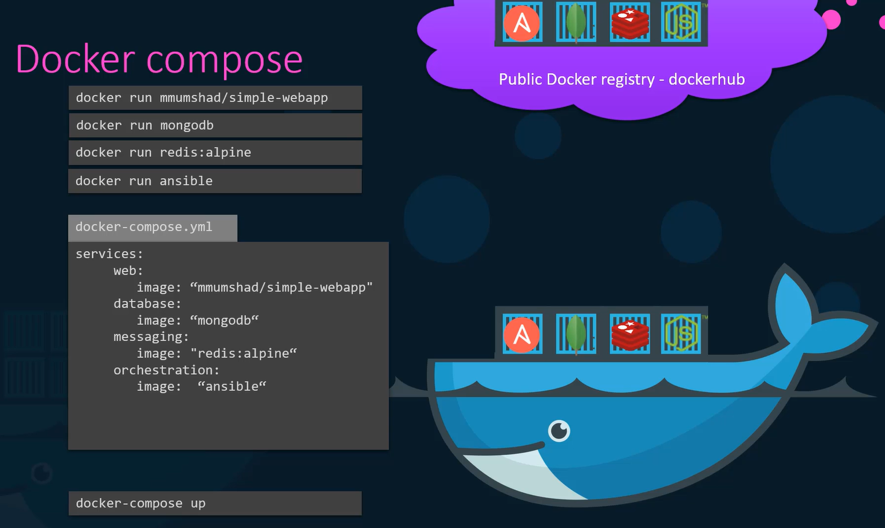

**Voting Application: (Example) On how to connect individual containers using links.**

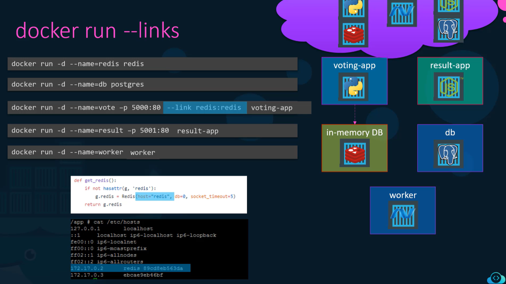

**Instead of running many Docker run commands(left side of the below image ) manually, Docker compose lets you define everything in one YAML file and start services with a single command**

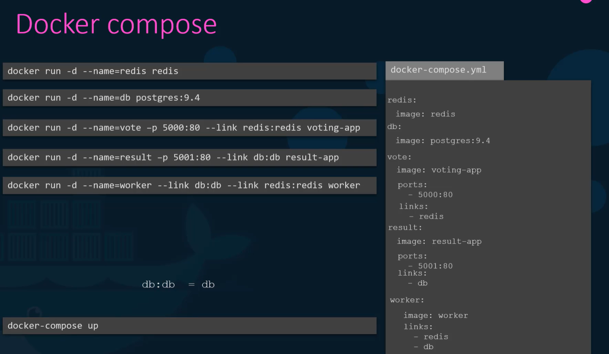

**If the image is not build, we use build key in the Docker compose file.**

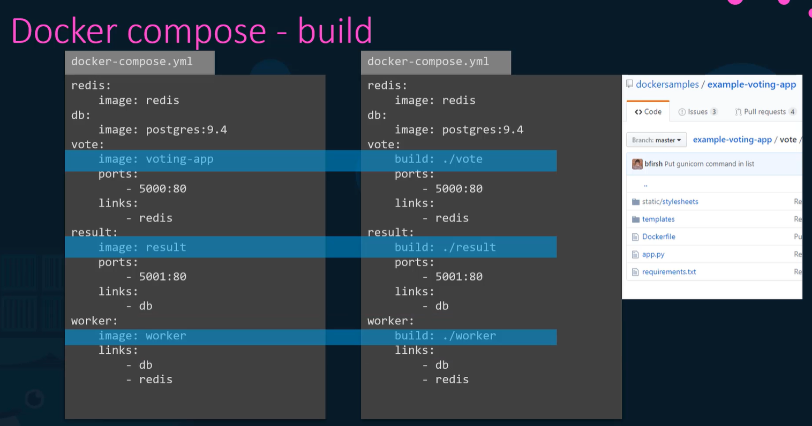

**Note:** Link is a command line option, which can be used to link 2 containers together.

**Docker Versions**

Docker compose file (version 1, version 2, version 3)

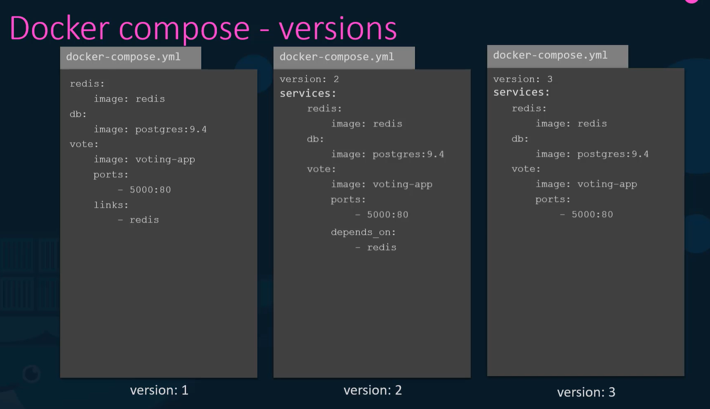

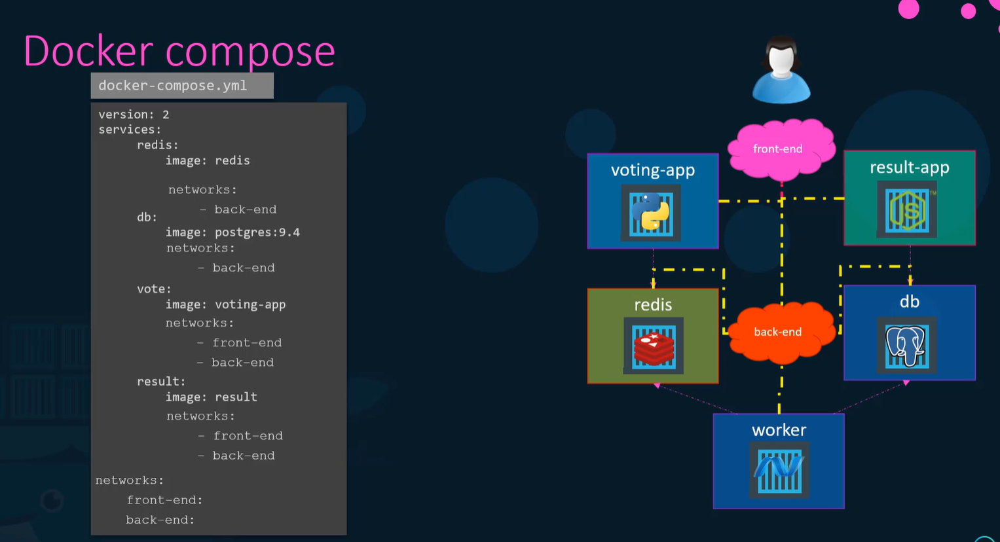

To start docker compose file – docker-compose –f filename.yml up

To stop the docker compose file - docker-compose –f filename.yml down

1.  > **Docker registry**

> If the containers were the rain, then they will rain from the docker registry which are the clouds.
> 
> That's where the docker images are stored. It’s a central repository of all docker images.
> 
> 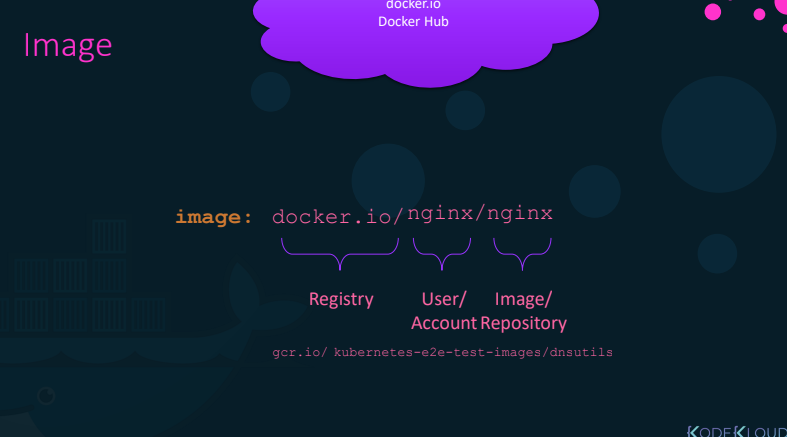
> 
> 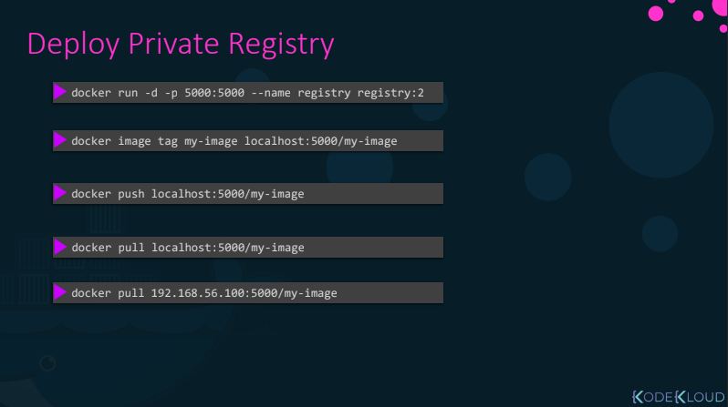

In order to push the image to a private repository, we must first tag the image with a private registry URL in it, then using the push command, we can push the image to the local private registry.

**Note:** Docker hub, besides public and private repositories, it also provides: automated builds, integration with source control solutions like Github and bitbucket etc.

2.  > **Docker engine**

> Docker engine is simply referred to a host with docker installed on it, when we install docker on
> 
> a linux host we’re actually installing 3 different components,
> 
> the docker daemon is a background process that manages docker objects such as the images,
> 
> containers, volumes and networks.
> 
> The docker REST API server is the API interface that programs can use to talk to the daemon and provide instructions.
> 
> The docker CLI is nothing but the command line interface, that is used to perform actions such
> 
> as running , stopping containers etc. It uses the rest API to interact with the docker daemon.
> 
> 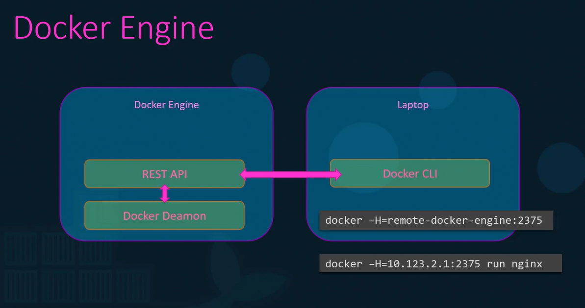

3.  > **NAMESPACE – PID**

Namespaces are one of the core Linux features that Docker uses to isolate containers. In simple terms: A **namespace makes a container think it has its own system resources, even though it shares the same host OS.** So each container feels like it is running on its own machine, but actually everything runs on the same Docker host.

> 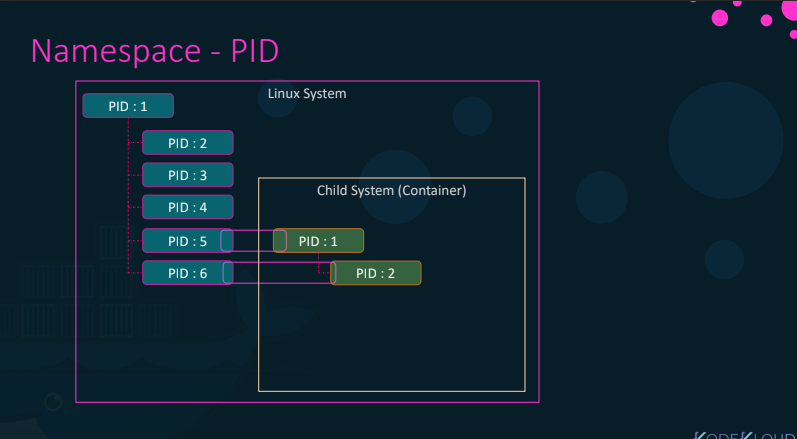

**What is happening internally?**

Host view:

Docker host processes -  
PID: 2

PID: 3

PID: 4

PID: 5 - container bash

PID: 6 - container ps

Container view:

PID - 1 - container bash

PID -2 - container ps

**The same processes have different PID views. This is called PID namespace.**

Containerization technology allows the process to be isolated and run inside a container using

named spaces. So it runs with the process id of one inside the container and outside on the docker

host it runs another process with another process ID.

> **CGroups - Control groups**
> 
> 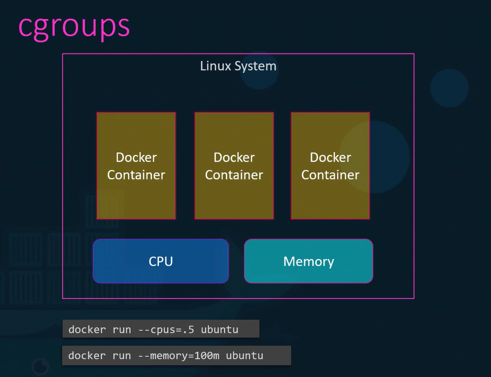
> 
> Docker containers on the host share the same underlying resources like CPU, Memory etc. there is no restriction for a container to use a particular amount of resource space,so it may end up utilizing all of the resources on the underlying host. But there is a way to restrict the amount of CPU or memory a container can use, docker uses 3 groups or control groups to restrict the amount of hardware resources allocated to each container. This can be done by providing the -- CPU use option to the docker command providing a value.
> 
> Example: docker run –cpu=.5 ubuntu 🡪 the container uses not more than 50% of the cpu space.  
> docker run –memory=100m ubuntu 🡪 it uses not more than 100mb of the memory.

4.  > **Docker storage**

> File system
> 
> When you install docker on a system, it creates the folder structure at **var/lib/docker** and you
> 
> Have multiple folders under it called **aufs, containers, image, volumes**, this is where docker  
> stores all its data by default, data means files related to images and containers running on the  
> docker host.
> 
> layered architecture
> 
> when docker builds image it builds these in a layered architecture, each line of instruction in
> 
> the docker file creates a new layer in the docker image with just the changes from the
> 
> previous layer.
> 
> 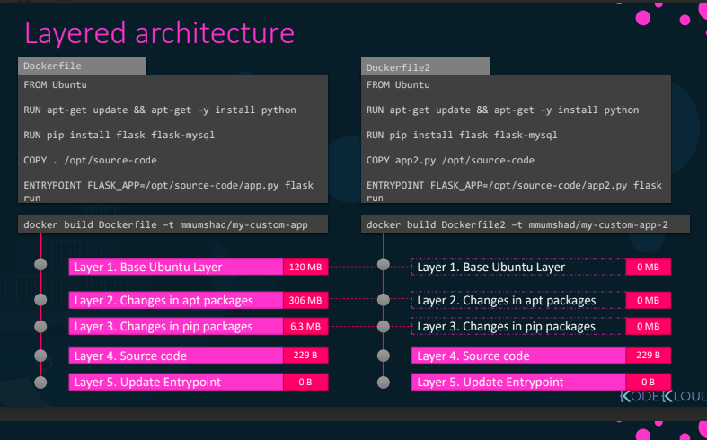
> 
> 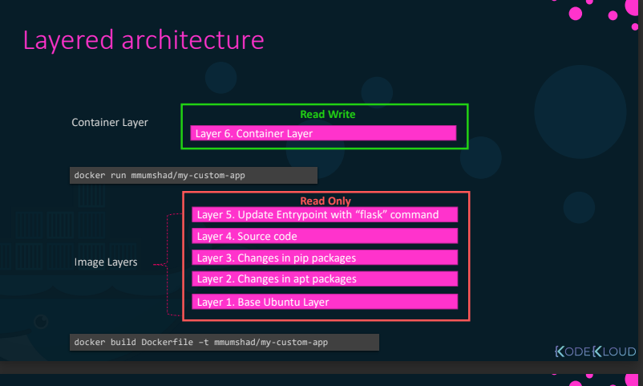
> 
> 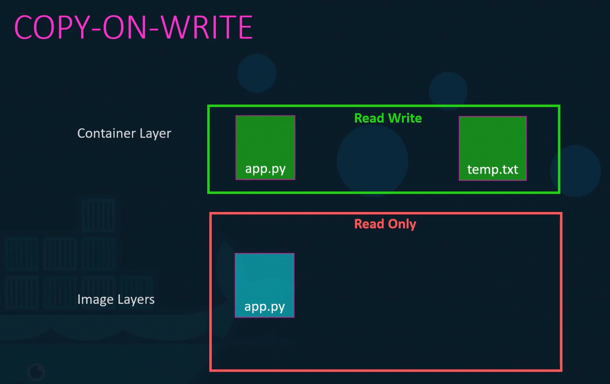
> 
> 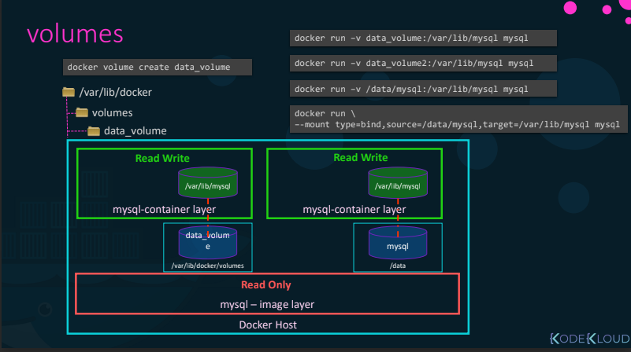
> 
> In the above, when we run the docker build command for **dockerfile2** to build a new image, for
> 
> this application since the first three layers of both the applications are the same, docker is not
> 
> going to build the first 3 layers, instead it reuses the same 3 layers it built for the first application
> 
> from the cache and only creates the last 2 layers with the new sources and the new entry point,
> 
> This way Docker builds images faster and efficiently saves disk space.
> 
> There are two types of mounts a **volume mounting and a bind mount volume**, volume mount
> 
> Mounts a volume from the volumes directory and bind mount mounts a directory from any
> 
> Location on the docker host.
> 
> **Using –v option is the old method in docker run commands, as of now, we use - - mount option,** i.e., **docker run \\ - - mount type=bind, source=/data/mysql, target=/var/lib/mysql mysql**. Source 🡪 the location on my host, and target is the location on my container.

Who is responsible for doing all of these operations? Maintaining the layered architecture.

Creating a writable layer moving files across layers to enable copy and write etc. It's the  
**storage drivers.** So Dockery uses storage drivers to enable layered architecture.

> The storage drivers are responsible for all the operations such as maintaining the layered archic-
> 
> tecture, creating a writable layer, moving files across layers to enable copy and write etc. even
> 
> The docker uses storage drivers to enable layered architecture. Some of the common storage
> 
> drivers are AUFS, BTRFS, ZFS, Device Mapper, overlay and overlay2. The selection of the
> 
> storage driver depends on the underlying OS being used, for example with Ubuntu, the
> 
> storage driver is UFS, whereas this storage driver is not available on other OS’s like fedora or
> 
> cent OS, in that case device mapper may be the best option.

**Docker network** (Important)

When you install docker it creates 3 networks automatically: **bridge, none and host**. Bridge is the default network a container gets attached to. The default bridge network with the network id 172.17.0.1. If we would like to associate the container with any other network, we specify the network information like, **docker run ubuntu - - network=none**, **docker run ubuntu - - network=host.**

The bridge network is the private internal network created by docker on the host, all containers attached to this network by default and they get an internal IP address, usually in the series 172.17.., the containers can access each other using this internal IP if required.

To make access to these containers, to the outside world – one way is to map the ports of container and host, and the other way to access is to associate the container to the **host network**. Using the host network, takes out any network isolation between the docker host and the docker container. With this, it is not possible to run multiple web containers on the same host on the same port, as the ports are now common to all containers in the host network.

With the none network, the containers are not attached to any network and doesn’t have any access to the external network or other containers, they run in an isolated network.

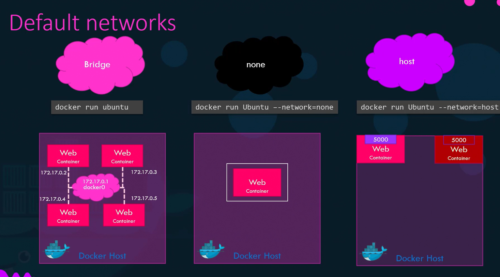

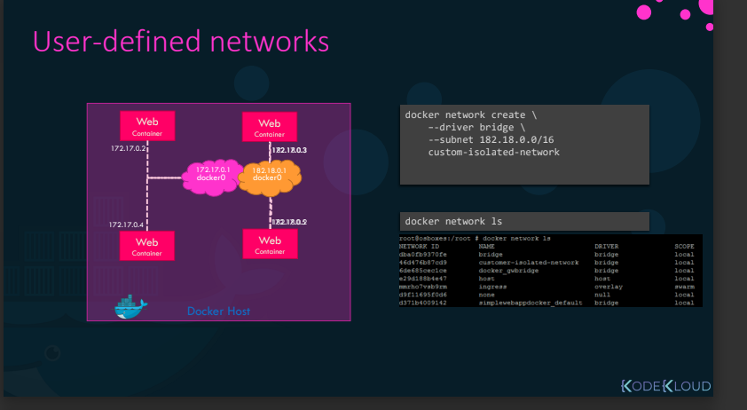

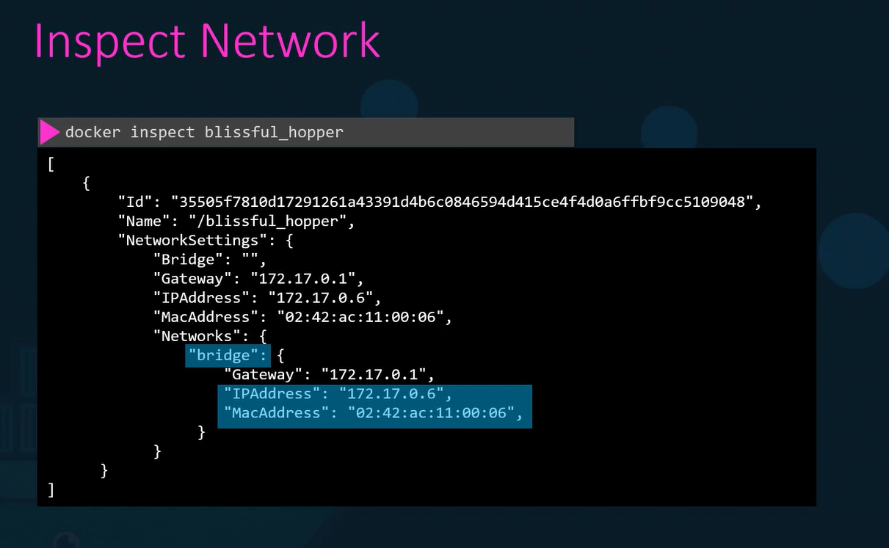

**Embedded DNS**

All the containers in a docker host can reach each other with the name of the container. Docker has a built-in DNS server that helps the containers to resolve each other using the container name. Note that the built in DNS server always runs at address 127.0.0.11.

How were the containers isolated within the host, docker uses **network name spaces** that creates a separate namespace for each container. It then uses virtual ethernet pairs to connect containers together.

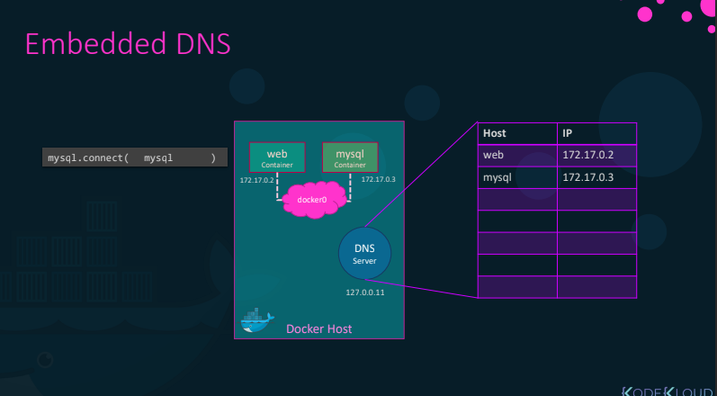

> Default network is the bridge network
> 
> To inspect the container or to get more details – docker inspect containername or id
> 
> To inspect bridge network docker network inspect networkname or
> 
> docker inspect network networkname
> 
> To check ip address of container from host machine –
> 
> docker inspect containername | grep –I ipaddress
> 
> To check ip address – ip a
> 
> To list all the networks – docker network ls
> 
> To create a network – docker network create networkname
> 
> To copy one container from default network to custom network –
> 
> docker network connect customnetworkname containername
> 
> To disconnect container from network –
> 
> docker network disconnect networkname containername
> 
> To connect container to the network –
> 
> docker network connect networkname containername

5.  > **Docker volumes**

> Docker volumes are file systems mounted on containers to preserve data generated by the
> 
> running containers. Docker volumes are used for data persistence. There are 3 types of volumes,
> 
> and so different ways of creating them
> 
> Usually the way to create docker volumes is using docker run command using –v option and the
> 
> path of the folder.
> 
> The second type is where you create a volume just by referencing the container directory, these
> 
> are called anonymous volumes (automatically generates a folder).
> 
> The 3rd volume type is actually an improvement of the anonymous volumes and it specifies the
> 
> name of that folder on the host file system. These are called named volumes (mostly used in a
> 
> production).
> 
> To create volume – docker volume create volumename
> 
> To list the volumes – docker volumes ls
> 
> To inspect volume – docker volume inspect volumename
> 
> 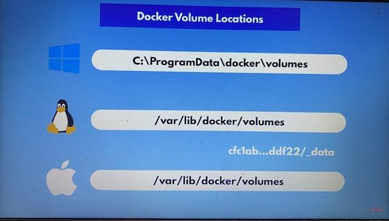
> 
> 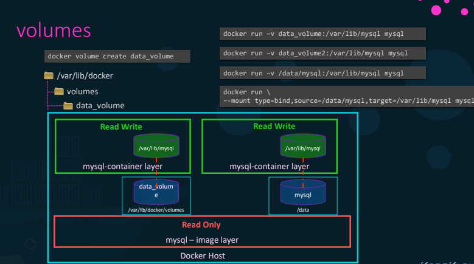

6.  > **Docker vaults**

> Vaults are used to protect credentials and any other sensitive information, for this to be achieved
> 
> a third party plugin called hashicorp is to be installed.

7.  > Run-tag  
    > To run an older version – docker run imagename:version (ex: docker run reddis:4.0)

8.  > Advanced docker run features

> To know what version of image is downloading – docker run ubuntu cat /etc/\*release\*
> 
> Attach and detach modes
> 
> Attach mode (attach to the console, we won’t be able to perform any command operations)
> 
> For example – docker run ubuntu sleep 100
> 
> Detach mode (runs in the background)
> 
> For example – docker run –d ubuntu sleep 100
> 
> To attach to the console – docker attach containerid
> 
> To map the port of docker host to docker container – docker run –p 8080:8080 jenkins
> 
> To map docker volume so that the data can be stored, incase of container stopped or restarted –
> 
> Docker run –p 8080:8080 –v /root/createddirectoryname:/var/jenkins/jenkins\_home –u(user)
> 
> root jenkins

## Workflow of Docker Architecture

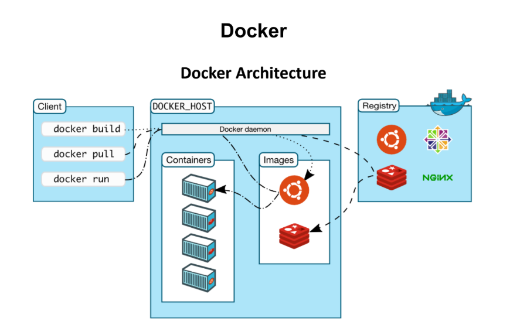

Step-by-step process:

1.  > User runs a command using **Docker Client**.

2.  > The client sends the request to **Docker Daemon**.

3.  > The daemon checks if the image exists locally.

4.  > If not available, it **pulls the image from Docker Registry**.

5.  > The daemon creates and starts the **container** using that image.

6.  > The container runs the application

<!-- end list -->

9.  > **Container orchestration**

> It is a solution that consists of a set of tools and scripts that can help host containers in a
> 
> production environment, typically a container orchestration solution consist of multiple docker
> 
> hosts that can host containers, that way even if one fails the application is still accessible
> 
> through the others, a container orchestration solution easily allows you to deploy hundreds or
> 
> thousands of instances of your application with a single command.
> 
> docker service create –replicas=100 nodejs (command used for docker swarm)
> 
> some orchestration solutions can help you automatically scale up the number of instances
> 
> when users increase and scale down the number of instances when the demand decreases. Some
> 
> solutions can even help you in automatically adding additional hosts support the user load and
> 
> not just clustering and scaling the container orchestration solutions, also provide advanced
> 
> networking between these containers across different hosts, as well as load balancing user
> 
> requests across different hosts.
> 
> There are multiple container orchestration solutions available today
> 
> Docker has docker swarm – lacks advanced auto scaling features required for complex
> 
> Production of great applications.
> 
> Kubernetes from google
> 
> MESOS from apache

**Docker commands**

To check the version of the OS that you downloaded – cat /etc/\*release\*

To run the container – docker run “imagename” (if image not available it pulls the latest image from docker hub and runs, unless specific version is specified)  
The docker run command is used to run a container from an image.

To run docker container in interactive mode – docker run –it(interactive & terminal mode) imagename

To run image with a specific version – docker run imagename:x.0 (this x.0 is called as tag)

To lists all the running containers – docker ps (displays container I.D, imagename)

To get the number of running containers - docker ps -q | wc -l

To lists all the containers stopped and also the exited ones – docker ps -a

To stop a container – docker stop container id or name

To delete(to remove stopped or exited containers) the containers permanently ( to clean the disk space) – docker rm container id or name

To delete the containers all at once – docker rm id1 id2 id3

To delete all containers in stopped state - docker container prune

To see the images that are currently in – docker images

To get the number of docker images without counting the first line(as it is a Index) - docker images | tail -n +2 | wc -l

To remove the images – docker rmi (i-image) imagename

To just download the image and not run as a container – docker pull imagename

To run a command inside a running container to know the host details first identify the container you want to work with and then do a docker exec container id/name cat /etc/hosts

To run a docker image in the background (detach from screen and you’ll be back to command prompt) – docker run –d imagename

To attach back to the running container (from detached mode) – docker attach container id / name

To check container environment variables quickly - docker exec \<container\_name\> env

To give a name to a Docker container when running it using the --name flag - docker run --name your\_container\_name your\_image

To map a docker host port(80) to container port (8000) - docker run -p 80:5000 imagename

To map volumes from a container to a file located on docker host - docker run -v /opt/datadir(filename on docker host):/var/lib/mysql(file on container) imagename.

To update internal repository – sudo apt-get update

To create user – sudo useradd knk0106

For password – sudo passwd knk0106

Configuration file is available in - /etc/ssh/sshd\_config

After any update in the configuration file we need to update the service – service sshd restart

To give permissions to the user – etc/sudoers

To add user to the docker group – usermod –aG docker username

To check user added to the group – id –nG

To search ubuntu – docker search ubuntu

To come out of the container – ctrl+pq

To start docker service – service docker start.

To check status of docker service – service docker status

Working principle- we first download the docker image and run it as a container, on the container we shall install the required services like java, git etc., and then convert the container to image push that image to docker hub (old process). In the new method, we will prepare the docker file using script.

To convert container to image – docker commit containerid imagename:version(like-12.0.1)

To login docker hub account in local – sudo docker login - -username=knk1691

To push the code to docker hub – sudo docker push imagename:version

To change the name of the image & run it – docker run –it - - name newname imagename

To change the name of the image – docker tag newname/oldname

To give name to the unnamed image – docker build . (for the current folder) –t(tag) newname

To build the image using the docker file – docker build .(for the current folder) –f dockerfile –t dockeraccountname / tagnamefortheimage  
This will create an image locally on your system to make it available on the public docker hub repository push to docker hub using push command. Specifying docker account name, makes connection with the repository.

To push image to docker hub – docker push imagename/dockerregistryname

To check docker server engine version – docker –v

To get to know more about docker – docker info

To get docker commands – docker - - help or docker

To get logs of the container – docker logs container id

To stream the logs – docker logs containerid –f

To power on a container which is in off state – docker start containerid

To power off a container which is in on state – docker stop containerid

To start a stop container – docker start containerid

To login to a container and execute a command – docker exec id/name commandname

So basically the exec command runs or executes a command on a running container.

To list the processes running inside the container – docker exec \<container id\> ps -eaf

To login into a container - docker exec –it containerid /bin/bash or /bin/sh

To automatically login into container, when it runs – docker run –it imagename bash

To list the particular process running on the host – ps –eaf | grep processname

To see how a particular image is built – docker history imageid

To see the actual space consumption on the desk – docker system df

To see the various steps involved in building an image – docker build output.

To see a space breakdown by image – docker system df –v

To run container – docker run –d --name containername -p 8081:8080 imagename

To know more details about the docker container(IP of container, environment variables, network etc) –  
docker inspect id / name

To pass environment variable while running container – docker run –e APP\_COLOR-blue imagename

To remove all images images at once – docker image prune –a

To list all the available and created networks -- docker network ls

To run tomcat apache server container – docker run –itd - -name webapp –p 8080:8080 tomcat

docker exec –it containerid /bin/bash

ls

cd webapps.dist

ls

cp –R(recursively) \*(current directory) ..(1 folder above)/webapps

[https://jhooq.com/docker-edit-file-inside-container/](https://jhooq.com/docker-edit-file-inside-container/)

The above steps are permitted only to the specific container, and when the container is stopped or restarted, the process needs to be executed again. For that purpose, we customize the docker image using docker file, so that the modification is permanent.
